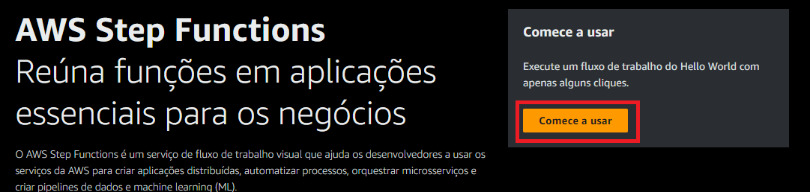
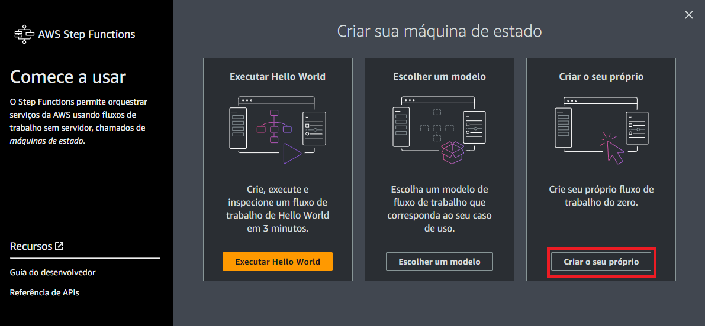
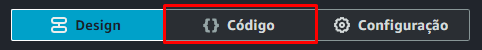
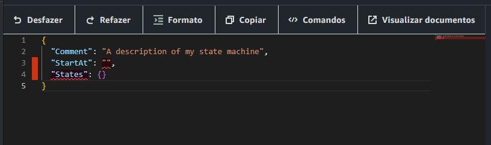
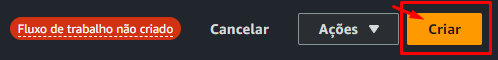
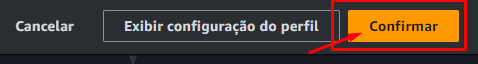
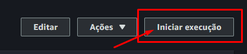
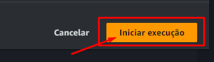

# Assistente de Delivery com AWS Step Functions e Bedrock.

Esse projeto se destina a ser a solução proposta para o desafio de fazer um assistente Assistente de Delivery usando o AWS Step Functions e o AWS Bedrock, do Bootcamp ***Nexa - Engenharia de Prompts na AWS com Claude***

## Índice

- [Implementação](#implementação)
- [Uso](#uso)
- [Créditos](#créditos)
- [Contato](#contato)

## Implementação

- Vá ao [console do Step Function](https://us-east-1.console.aws.amazon.com/states/home?region=us-east-1#/homepage) e clique no botão **Comessar a usar** de cor laranja:\

- Na janela que abriu, click no botão **Criar o seu próprio**:\

- Click no botão **código**:\

- Abra o arquivo [***Assistente-de-Delivery-com-AWS-Step-Functions-e-Bedrock_v1.0.json***](./Assistente-de-Delivery-com-AWS-Step-Functions-e-Bedrock_v1.0.json) ou o arquivo [***Assistente-de-Delivery-com-AWS-Step-Functions-e-Bedrock_v1.1.json***](./Assistente-de-Delivery-com-AWS-Step-Functions-e-Bedrock_v1.1.json), copie seu conteúdo e cole na caixa de edição de código do Step Function, apague o código já existente:\

- Click no botão Criar:\

- E para finalizar, clique em ***Confirmar***:\

## Uso

- Para ver a execução do projeto, click em ***iniciar execução***:\

- Em seguida, click em ***Iniciar execução***, na janela que abriu:\

## Créditos

Este projeto usa os seguintes recursos da AWS:
- O Step Functions 
- O Bedrock

E só me foi possível desenvolver esse projeto, graças ao bom trabalho da plataforma **Dio** e do auto nível de competência de seus colaboradores

## Contato
Para mais informações, entre em contato com *Andre Luiz Moura Borges*:
- andreluizbg82@gmail.com
